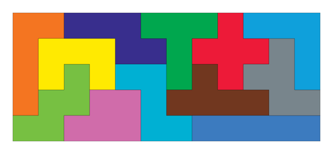

# Katamino

Code to solve katamino challenges

https://www.google.com/search?q=possible+3d+shapes+with+5+cubes&tbm=isch&tbs=rimg:CSQNxJ8fsWNSIji-ofdqClu2ABhBarS7FeGapRDWeLUNxs1qRnl89sVA2tzEDn816YWH_1HY5yH10NA-_17-HXsPY8gioSCb6h92oKW7YAEaB9T9vB-0ULKhIJGEFqtLsV4ZoRvRWnFOCe1FEqEgmlENZ4tQ3GzRGgfU_1bwftFCyoSCWpGeXz2xUDaEQVNX4nbK_1LQKhIJ3MQOfzXphYcRTIrUAaKHh6AqEgn8djnIfXQ0DxGgfU_1bwftFCyoSCb_1v4dew9jyCEYM14tV58aja&tbo=u&sa=X&ved=2ahUKEwjm6eXIoKrgAhUWoYMKHbGyCWgQ9C96BAgBEBs&biw=1472&bih=773&dpr=1#imgrc=DP2sMs4PxF6rnM:

## Small Slam 
Start with first 3 pieces.

|      |        |
| ---- | ------ |
| A |  |
| B |  |
| C |  |
| D |  |
| E |  |
| F |  |
| G |  |

## Slam 1
Start with first 5 pieces.

A:  
B:  
C:  
D:  
E:  
F:  
G:  
H:  
I:  
J:  
K:  
L:  
M:  
N:  

Start with first 6 pieces.

O:  
P:  
Q:  
R:  
S:  
T:  
U:  
V:  
W:  
X:  
Y:  
Z:  
Spades:  
Hearts:  
Diamonds:  
Clubs:  

## Ultimate Challenges 1
Start with first 4 pieces.

A:  
B:  
C:  
D:  
E:  
F:  
G:  
H:  
I:  
J:  
K:  
L:  

## Ultimate Challenges 2
Start with first 5 pieces.

A:  
B:  
C:  
D:  
E:  
F:  
G:  
H:  
I:  
J:  
K:  
L:  

## Ultimate Challenges 3
Use all 9 pieces.

A:  
B:  
C:  
D:  
E:  
F:  
G:  
H:  
I:  
J:  
K:  
L:  

## Ultimate Challenges 4
Start with first 7 pieces.

No1:  
No2:  
No3:  
No4:  
No5:  
No6:  
No7:  
No8:  
No9:  
No10:  
No11:  
No12:  
No13:  
No14:  
No15:  
No16:  
No17:  
No18:  
No19:  
No20:  
No21:  
No22:  
No23:  
No24:  
No25:  
No26:  
No27:  
No28:  
No29:  
No30:  
No31:  
No32:  
No33:  
No34:  
No35:  
No36:  
No37:  
No38:  
No39:  
No40:  